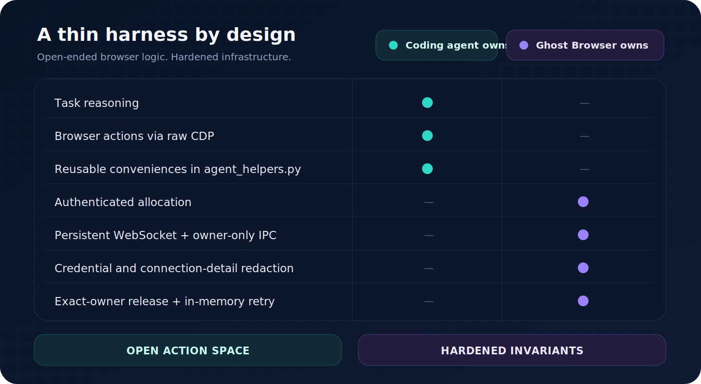
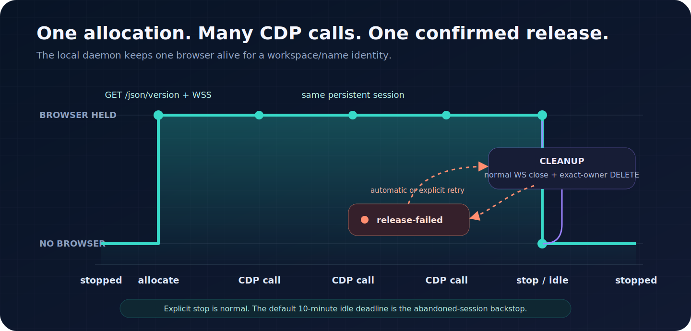

<div align="center">
  

  <h1>Ghost Browser</h1>

  <p><strong>An Apify-native browser harness for coding agents.</strong></p>

  <p>
    
    
    
    
    
  </p>
</div>

Ghost Browser gives your coding agent a Ghost-patched stealth Chromium session on Apify through raw Chrome
DevTools Protocol and ordinary Python. A small local daemon keeps one browser alive across agent calls and
owns allocation, connection handling, redaction, and release.

> [!IMPORTANT]
> The code is public. The hosted Ghost Gateway requires an Apify account and `APIFY_TOKEN`. The token
> authenticates the Gateway and attributes its usage; you do not need it to install Ghost Browser.

## Prompt for your coding agent

Paste this into Codex, Claude Code, or another coding agent with shell access:

```text
Install Ghost Browser from the public repository with `uv tool install --python 3.12 git+https://github.com/yfe404/ghost-browser.git`. It is an Apify-native browser harness: use the `APIFY_TOKEN` already in my environment to authenticate with Ghost Gateway, but never print the token, write it to disk, or put it in a command argument. Verify the installation by running `Browser.getVersion` through `ghost-browser`. Release the test browser afterward and confirm that `ghost-browser status` reports `stopped`.
```

<details>
<summary><strong>Try the browser-interaction demo</strong></summary>

```text
After setup, open https://sentinel-bot-detector.vercel.app/. Interact through real CDP input, save the final screenshot as ghost-browser-demo.png, report the detector result and scores, then stop the browser and confirm that `ghost-browser status` reports `stopped`.
```

</details>

<details>
<summary><strong>Try the fingerprint-verdict demo</strong></summary>

```text
After setup, open https://deviceandbrowserinfo.com/are_you_a_bot and wait until its fingerprint verdict is visible. Save a final screenshot as ghost-browser-fingerprint-verdict.png. Report the exact visible verdict heading (for example, “You are human!”), the `isBot` value from the raw detection details, and any detection fields whose value is `true`. Then stop the browser and confirm that `ghost-browser status` reports `stopped`.
```

</details>

## A small harness with an open action space

Your coding agent decides how to inspect, navigate, click, type, and extract. Ghost Browser keeps the
infrastructure predictable. The editable helper file starts empty, so agents add conveniences only after a
task proves them useful.

<p align="center">
  
</p>

The protected package contains no task-specific navigation or click DSL. It exposes raw `cdp()` plus a small
set of page attachment, JavaScript, tab, screenshot, and event conveniences.

## Install

Install the public repository:

```sh
uv tool install --python 3.12 git+https://github.com/yfe404/ghost-browser.git
```

Set `APIFY_TOKEN` in the environment to use the hosted Gateway. Ghost Browser does not put it in process
arguments or project files.

<details>
<summary><strong>Other installation paths</strong></summary>

From an existing checkout:

```sh
uv tool install --python 3.12 --editable .
pipx install --python python3.12 --editable .
```

Install the public repository with `pipx`:

```sh
pipx install --python python3.12 git+https://github.com/yfe404/ghost-browser.git
```

</details>

## Use it directly

Run ordinary Python with browser primitives already in scope:

```sh
ghost-browser <<'PY'
print(cdp("Browser.getVersion", session_id=None)["product"])
print(page_info())
PY
```

The next invocation in the same working directory reuses that browser:

```sh
ghost-browser <<'PY'
page = ensure_page()
cdp(
    "Page.navigate",
    {"url": "https://example.com"},
    session_id=page["session_id"],
)
print(js("({ title: document.title, url: location.href })"))
PY

ghost-browser stop
ghost-browser status
```

`cdp()` defaults to browser scope. Pass `session_id` for page-scoped commands.

| Primitive | Purpose |
|---|---|
| `cdp(method, params, session_id=...)` | Send any CDP command |
| `ensure_page()` | Attach to a page target and return its IDs |
| `js(expression)` | Evaluate JavaScript on the attached page |
| `page_info()` | Read the current URL, title, and viewport |
| `tabs()` | List page targets |
| `capture_screenshot(path)` | Save a PNG screenshot |
| `drain_events()` | Read buffered raw CDP events |

Run `ghost-browser workspace` to find the project-scoped `agent_helpers.py` file.

<details>
<summary><strong>Raw CDP example</strong></summary>

```sh
ghost-browser <<'PY'
targets = cdp("Target.getTargets")["targetInfos"]
page = next(target for target in targets if target["type"] == "page")
session = cdp(
    "Target.attachToTarget",
    {"targetId": page["targetId"], "flatten": True},
)["sessionId"]

cdp("Page.navigate", {"url": "https://example.com"}, session_id=session)
result = cdp(
    "Runtime.evaluate",
    {
        "expression": "({ title: document.title, url: location.href })",
        "returnByValue": True,
    },
    session_id=session,
)
print(result["result"]["value"])
PY
```

</details>

## One allocation per working session

The first invocation allocates a browser. Later invocations reuse its WebSocket until explicit stop or the
idle deadline. `GHOST_BROWSER_NAME` lets one working directory hold more than one independent browser.

<p align="center">
  
</p>

Run `status` and `stop` with the same working directory, browser name, Gateway configuration, and caller
credential that started the session.

```text
ghost-browser                  execute Python from stdin
ghost-browser status           show connected, starting, stopped, or release-failed
ghost-browser stop             release the remote browser
ghost-browser workspace        print the editable helper directory
ghost-browser skill            print the optional agent skill
ghost-browser --version        print the installed version
```

## Release belongs in every task

`ghost-browser stop` requests a normal WebSocket close and sends an idempotent exact-owner DELETE backstop.
The daemon releases an abandoned browser after ten idle minutes by default.

If exact-owner cleanup cannot be confirmed, status becomes `release-failed`. The owner-only daemon keeps the
release capability in memory and retries. Run `stop` again while the original session identity remains
available.

## Trust boundary

Ghost Browser runs stdin Python and project helpers with the coding agent's existing authority. It does not
sandbox them.

- The daemon socket and state directories are owner-only.
- The harness keeps caller tokens, WebSocket URLs, browser IDs, and URL queries out of logs and user-facing
  errors.
- The harness does not persist caller tokens or returned WebSocket URLs.
- A command that times out after sending is not replayed; its outcome is reported as unknown.
- Page content is untrusted. Purchases, submissions, messages, uploads, account changes, and destructive
  actions require explicit user authorization.

<details>
<summary><strong>Configuration</strong></summary>

| Variable | Purpose | Default |
|---|---|---|
| `APIFY_TOKEN` | Caller credential and billing identity | required for the hosted Gateway |
| `GHOST_GATEWAY_URL` | Ghost Gateway HTTP endpoint | hosted Ghost Gateway |
| `GHOST_BROWSER_NAME` | Additional local session discriminator | `default` |
| `GHOST_BROWSER_IDLE_SECONDS` | Abandoned-browser release deadline | `600` |
| `GHOST_BROWSER_ALLOCATION_TIMEOUT` | Cold allocation deadline | `180` |
| `GHOST_BROWSER_WS_TIMEOUT` | WebSocket handshake deadline | `30` |
| `GHOST_BROWSER_HOME` | Config and editable workspace root | `~/.config/ghost-browser` |

The legacy `GHOST_STANDBY_URL` variable is also accepted.

</details>

## Feedback

[Open an issue](https://github.com/yfe404/ghost-browser/issues) with the browser task, expected result,
actual result, `ghost-browser --version`, and the final `ghost-browser status`.

Do not attach tokens, WebSocket URLs, browser identifiers, daemon files, or unredacted command output.

## Project docs

- [Agent setup](agent.md)
- [v0.1 specification](SPEC.md)
- [Contributing](CONTRIBUTING.md)
- [License](LICENSE)
